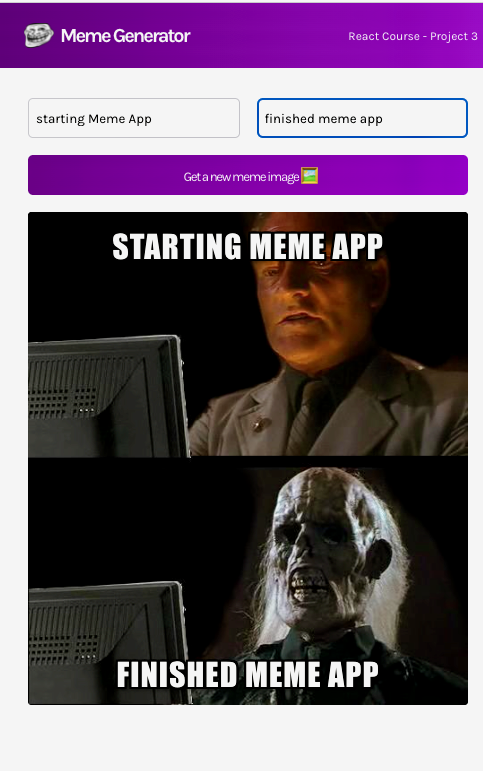

# Project 5 - Meme Generator

This is a Meme Generator created with React for a course on React skills with Bob Ziroll. It is a dynamic interactive page, with a header and a body. Practice with event listeners, state, conditional rendering, forms and side effects.

## Features

- Header with logo and name of project and cool color gradient
- Body with fields to type text on top and bottom of meme image
- Button to generate new image for the meme
- Visualization of image and texts together, the final result

## Technologies

- HTML
- CSS
- JavaScript
- React

## Start the App

In the project directory, you can run:

### `npm start`

Runs the app in the development mode.\
Open [http://localhost:3000](http://localhost:3000) to view it in your browser.

The page will reload when you make changes.\
You may also see any lint errors in the console.

### `npm test`

Launches the test runner in the interactive watch mode.\
See the section about [running tests](https://facebook.github.io/create-react-app/docs/running-tests) for more information.

### `npm run build`

Builds the app for production to the `build` folder.\
It correctly bundles React in production mode and optimizes the build for the best performance.

The build is minified and the filenames include the hashes.\
Your app is ready to be deployed!

See the section about [deployment](https://facebook.github.io/create-react-app/docs/deployment) for more information.

## Further Help

You can learn more in the [Create React App documentation](https://facebook.github.io/create-react-app/docs/getting-started).

To learn React, check out the [React documentation](https://reactjs.org/).

### Author

[Tanimara Elias Santos](https://github.com/tanimaraeliassantos)

### Version

1.0.0
